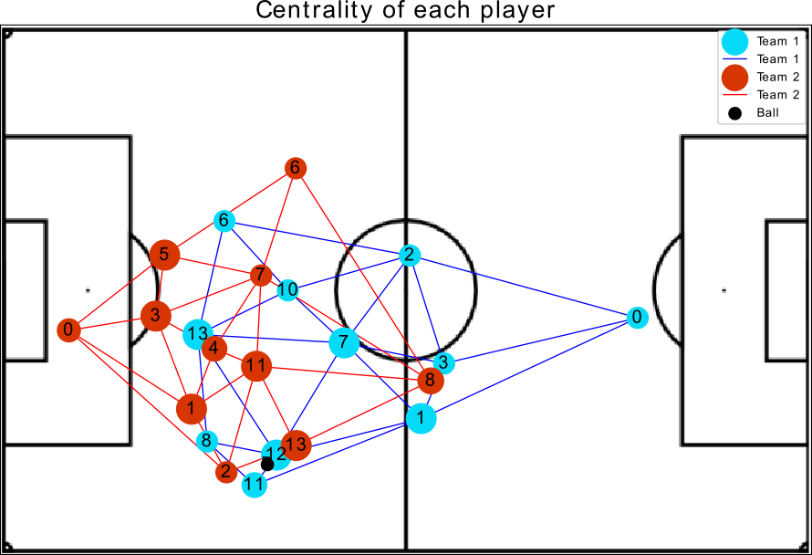
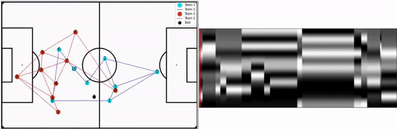

# soccer_graph_classification
Using machine learning pipeline to predict entry into the attack zone in football

Example Data: https://doi.org/10.6084/m9.figshare.19222746

With the player's position, we create a graph representation, where the vertices represent the players and the edges the possibility to players makes passes between them:

This represetation allows us to exctract metrics from these complex networks, in this work 8 metrics were obtained:

| Betweenness Centrality | Eccentricity | Global Efficiency| Local Efficiency |
| Vulnerability | Clustering Coefficient | Entropy| PageRank |

So each frame of video was generated a graph with the metrics, the image below demonstrate an example where the size of each node changes conform the player's Betweenness Centrality:

How we analyze a interval of the initial 5 seconds, all the metrics extracted are converted in a visual rhythm image, where in x axis represents the pass of time and y the player's metrics value (high values with light tons and low values closes to black):

In this way is possible to represent the game time series in a unique image:

